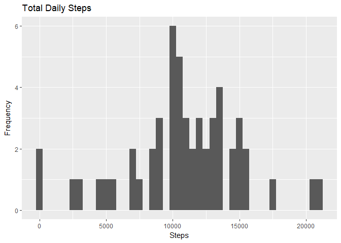
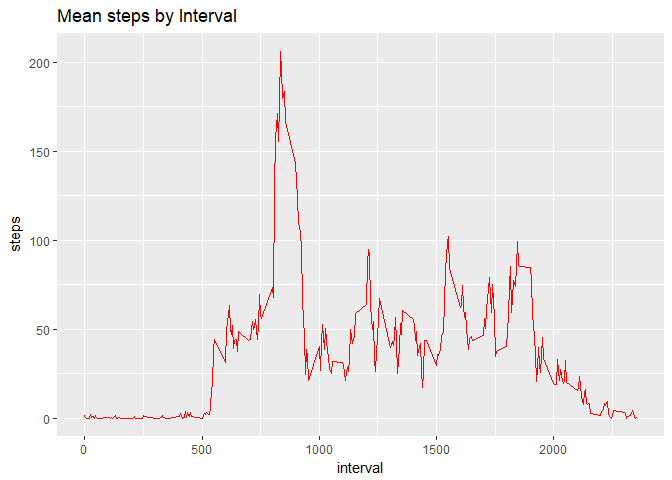
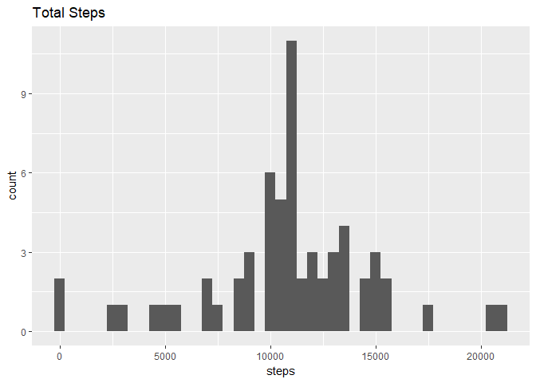
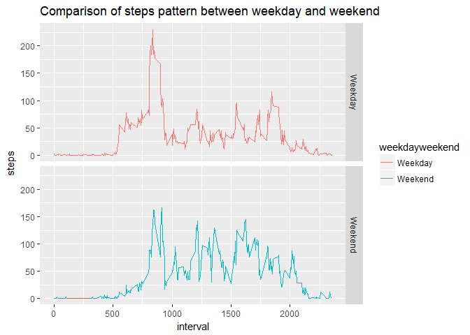

## Loading and preprocessing the data
1. Code for reading in the dataset and/or processing the data


```r
library(ggplot2)

# Unzip archive
unzip("activity.zip")

# Read base data into a data frame.
data <- read.csv("activity.csv")

# change date type to date class 
data$date <- as.Date(as.character(data$date))
```

## What is mean total number of steps taken per day?

2.Histogram of the total number of steps taken each day

```r
#aggregate steps by date
stepsbyday<-aggregate(steps~date,data,sum)
#plot histogram
ggplot(stepsbyday, aes(x = steps)) +
  geom_histogram(binwidth=500) +
  labs(title = "Total Daily Steps", x = "Steps", y = "Frequency")
```

<!-- -->
3.Mean and median number of steps taken each day

```r
mean(stepsbyday$steps,na.rm=T)
```

```
## [1] 10766.19
```

```r
median(stepsbyday$steps,na.rm = T)
```

```
## [1] 10765
```

## What is the average daily activity pattern?
4.Time series plot of the average number of steps taken

```r
#remove NA from steps column
rmnadata<-data[!is.na(data$steps),]
#aggregate steps by interval
meanstepsbyinterval<-aggregate(steps~interval,rmnadata,mean) 
#plot graph of mean no. steps vs interval
ggplot(meanstepsbyinterval,aes(x=interval,y=steps))+
       labs(title= "Mean steps by Interval")+
       geom_line(col="red")
```

<!-- -->
5.The 5-minute interval that, on average, contains the maximum number of steps

```r
meanstepsbyinterval[which.max(meanstepsbyinterval$steps),]
```

```
##     interval    steps
## 104      835 206.1698
```
## Imputing missing values
6.Code to describe and show a strategy for imputing missing data

```r
#number of missing values
length(data$steps[is.na(data$steps)])
```

```
## [1] 2304
```

```r
#create new dataset to remove NA
data2<-data
#remove NA from dataset
rmnadata<-data[!is.na(data$steps),]
# Impute values to NA values in new dataset
NAstepsdata<-is.na(data$steps)
meansteps<-tapply(rmnadata$steps,rmnadata$interval,mean)
data2$steps[NAstepsdata]<-meansteps[as.character(data2$interval[NAstepsdata])]
```


7.Histogram of the total number of steps taken each day after missing values are imputed

```r
#aggregate steps by date
stepsbyday<-aggregate(steps~date,data2,sum)
#plot histogram
ggplot(stepsbyday,aes(x=steps))+
      geom_histogram(binwidth = 500)+
      labs(title="Total Steps")
```

<!-- -->


```r
#new mean
mean(stepsbyday$steps)
```

```
## [1] 10766.19
```


```r
#new median
median(stepsbyday$steps)
```

```
## [1] 10766.19
```
Do these values differ from the estimates from the first part of the assignment? What is the impact of imputing missing data on the estimates of the total daily number of steps?
Yes, the values differ compared to the first dataset.By using mean data per interval to impute the data, the imputed value skews the overall data towards the mean.


## Are there differences in activity patterns between weekdays and weekends?
8.Panel plot comparing the average number of steps taken per 5-minute interval across weekdays and weekends

```r
#sort dates to weekend and weekday
data2$weekday<-weekdays(data2$date)
data2$weekdayweekend<-ifelse(data2$weekday=="Saturday"|data2$weekday=="Sunday","Weekend","Weekday")

#aggregate steps by interval and weekday/weekend
meanweekdayweekend<-aggregate(steps~interval+weekdayweekend,data2,mean)
#plot comparison graph
ggplot(meanweekdayweekend,aes(x=interval,y=steps,color=weekdayweekend))+
      geom_line()+
      facet_grid(weekdayweekend~.)+
      labs(title="Comparison of steps pattern between weekday and weekend", x="interval",            y="steps")
```

<!-- -->

